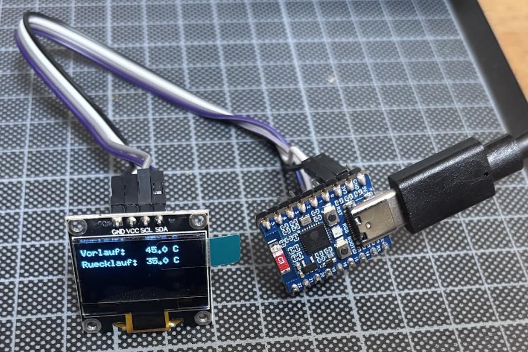
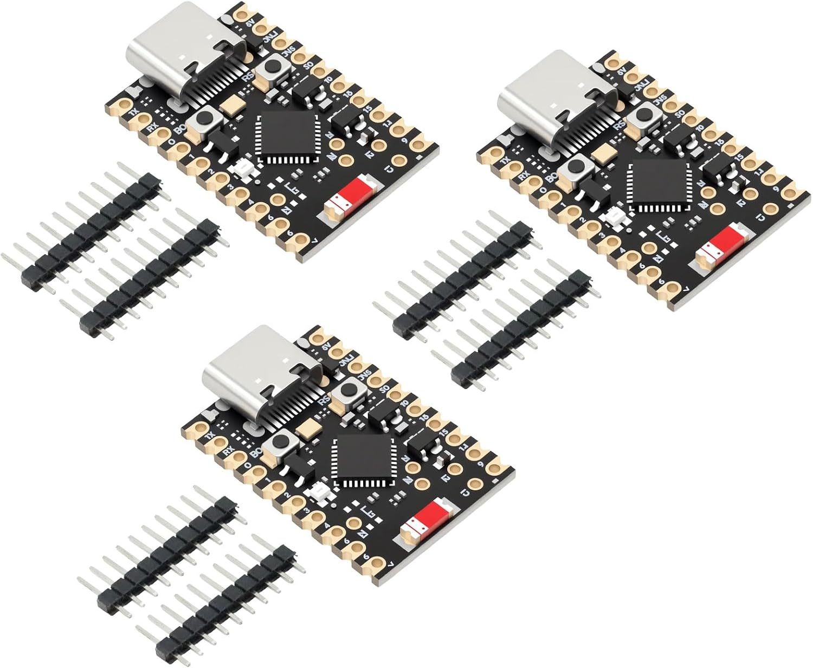
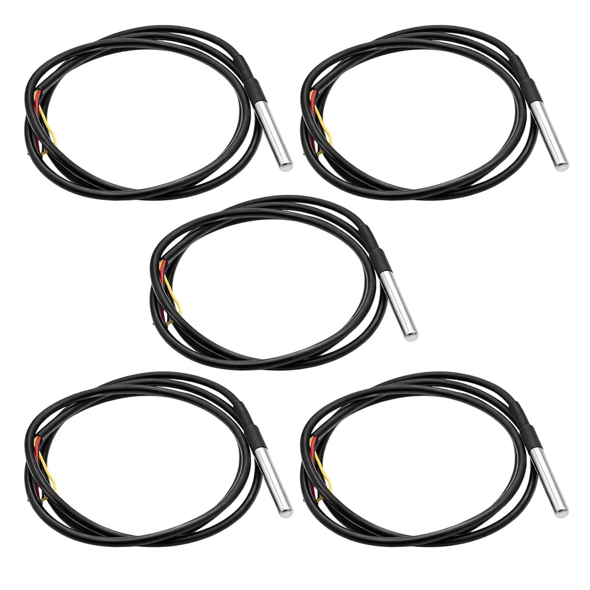
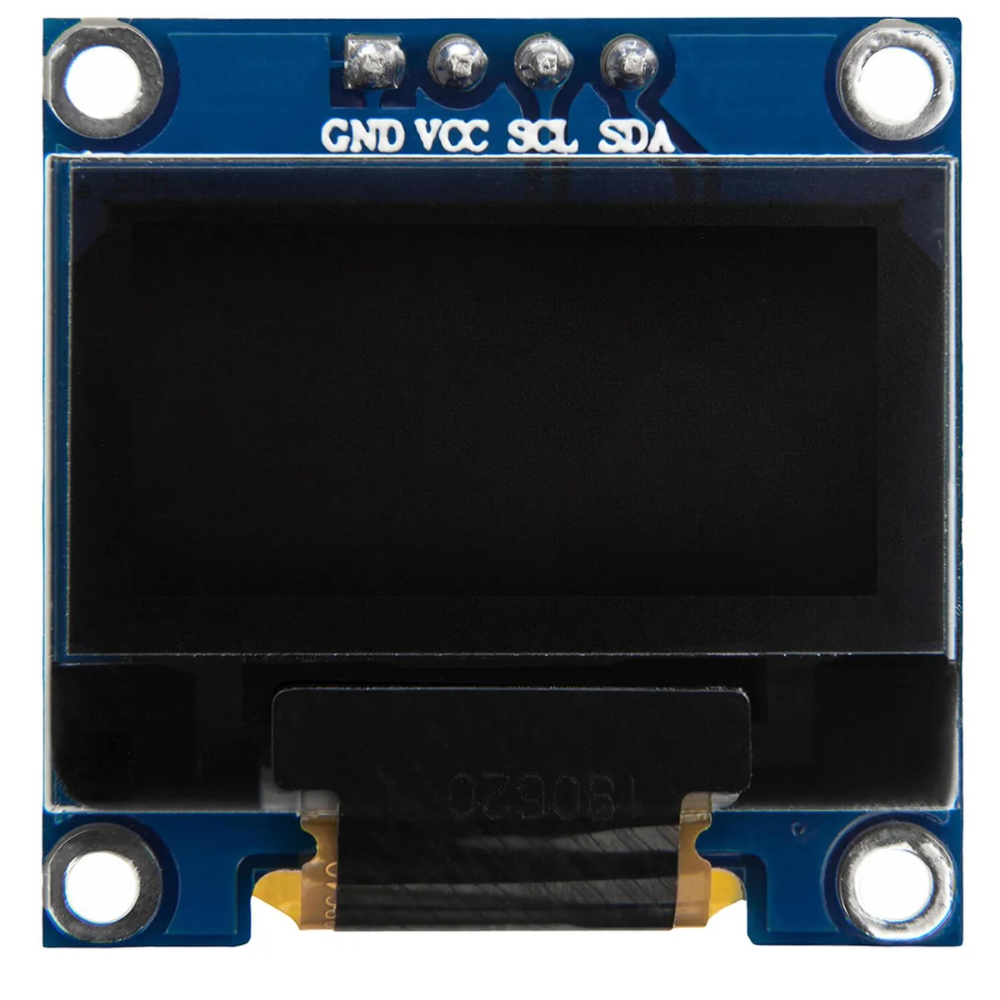

# 005_ZigbeeTemperatureReader

Zigbee-Temperatursensor auf Basis eines ESP32-C6, der die Vor- und
Rücklauftemperatur eines Heizkörpers misst und als Zigbee End Device
an Home Assistant meldet.

Entwickelt von **JoWizard**.

## Funktionsweise

- Zwei DS18B20-Temperaturfühler (wasserdicht, OneWire) werden am
  Vor- und Rücklaufrohr des Heizkörpers angebracht.
- Der ESP32-C6 liest beide Sensoren aus und stellt sie als zwei
  separate Zigbee-Endpoints bereit (ein Endpoint pro Messgröße).
- Ein kleines OLED-Display zeigt die aktuellen Werte lokal an.
- Home Assistant empfängt die Werte über den Zigbee-Koordinator
  (z. B. Zigbee2MQTT oder ZHA) wie ein handelsüblicher Temperatursensor.

> **Status:** Aktuell liest die Firmware testweise den internen
> Chip-Sensor als Platzhalter aus (ein Endpoint). Die Anbindung der
> beiden DS18B20-Fühler für Vor- und Rücklauf ist der nächste Schritt.



## Hardware

<table>
<tr>
<td></td>
<td>

**Microcontroller: ESP32-C6-Zero**
RISC-V, Wi-Fi 6, BT 5, IEEE 802.15.4/Zigbee, USB-C
[Produktseite (Amazon)](https://www.amazon.de/-/en/gp/product/B0FKH2M99L)

</td>
</tr>
<tr>
<td></td>
<td>

**Temperaturfühler: 2x DS18B20** (wasserdicht, OneWire)
je einer für Vorlauf und Rücklauf
[Produktseite (Amazon)](https://www.amazon.de/-/en/gp/product/B0DRCFD96D)

</td>
</tr>
<tr>
<td></td>
<td>

**Display: OLED 0.96", SSD1306-Controller, 128x64, I2C**
I2C an GPIO18 (SDA) / GPIO19 (SCL) — GPIO4-8/15 sind
Strapping-Pins, GPIO12/13 sind für USB reserviert
[Produktseite (Amazon)](https://www.amazon.de/-/en/gp/product/B0GLXCGXCW)

</td>
</tr>
</table>

- Taster: BOOT-Taster (GPIO9) — lang drücken löst einen Zigbee Factory Reset aus

> **Hinweis:** `platformio.ini` verwendet aktuell die Board-Definition
> `esp32-c6-devkitc-1`, da es keine passende PlatformIO-Boarddefinition
> für das ESP32-C6-Zero gibt. Das ist unkritisch, da beide Boards denselben
> ESP32-C6-Chip nutzen — Flash-Größe wird beim Upload automatisch erkannt.

## Software / Toolchain

- **IDE:** Visual Studio Code
- **Build-System:** [PlatformIO](https://platformio.org/)
- **Platform:** pioarduino-Fork von `espressif32` (das offizielle
  `espressif32`-Platform-Paket unterstützt den C6 nicht)
- **Framework:** Arduino (arduino-esp32 3.x) — die Zigbee-Bibliothek ist
  Bestandteil des Cores
- **Bibliotheken:** U8g2 (OLED-Ansteuerung)
- **Zigbee-Rolle:** End Device (`-DZIGBEE_MODE_ED`), eigene Partitionstabelle `zigbee.csv`

### Build / Flash / Monitor

```
pio run              # bauen
pio run -t upload    # flashen
pio device monitor   # serielle Ausgabe
```

### Setup-Hinweis (macOS)

PlatformIOs portables Python hat kein LZMA. Deshalb in den
VS-Code-User-Settings:

```
"platformio-ide.useBuiltinPython": false
"platformio-ide.customPyPath": "/Library/Frameworks/Python.framework/Versions/3.13/bin/python3.13"
```

Bei Problemen: `rm -rf ~/.platformio/penv ~/.platformio/python3` und VS Code neu laden.
